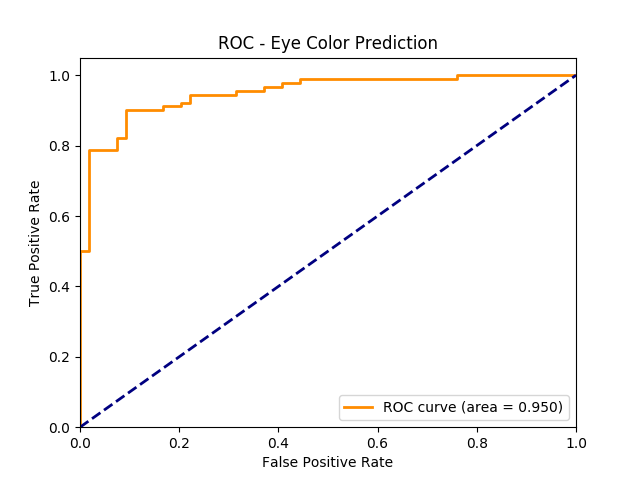

# Summary

This project applies machine learning to publicly available genomic data to predict phenotype and identify Single Nucleotide Polymorphisms (SNPs) that are most influential.
The method requires no domain knowledge and can be used with any binary phenotype classification.

As a proof of concept, this application was used to predict eye color using 436 users from self-reported data on openSNP.
Using the default settings, the model achieved a 90% accuracy and 0.95 AUC for the ROC curve.

The model correctly identified HERC2 as the most influential gene and identified the polygenic relationship between genes
HERC2 and OCA2.



# Prerequisites

## Matplotlib

Matplotlib is used to generate a ROC curve after the model is built. [See the documentation](https://matplotlib.org/faq/installing_faq.html#installation) for operating system specific
requirements for matplotlib.

## Graphviz

Graphviz is used to generate a decision tree visualization when using the decision tree model flag.
Download and install the executable [from here](https://graphviz.gitlab.io/download/).

## Python Packages

It is recommended to install this application in a virtual environment.
To create and activate the virtual environment run:

```commandline
# install virtualenv if it is not already installed
pip install virtualenv

# create virtualenv
virtualenv -p <python2.7 path> genopheno_ve
```

Activate the virtualenv on macOS and Linux.

```commandline
source genopheno_ve/bin/activate
```

Activate the virtualenv on Windows.

```commandline
genopheno_ve\Scripts\activate
```

From the repository directory, install the genopheno requirements.

```commandline
pip install -r requirements.txt
```

# Running with Sample Data

Out of the box, the application comes with sample data to predict eye color.

The commands in this section assume the virtual environment from the prerequisites step is activated and that the
current directory genopheno/genopheno (the root package directory).
Execute the following commands to use the sample data and default model settings.

```commandline
# Preprocess the data
python preprocess.py

# Build the model
python model.py

# Use the model to predict phenotypes
python predict.py
```

Note, there is not enough data to produce a well trained model.
The data is included as a quick way to understand how to run the application.

# Running the Application

The application is broken down into three steps, each with their own command-line interface.

1. Preprocessing the genomic data. This step converts user genotypes at each SNP to a mutation count.
2. Building the model. This step uses the preprocessed data to build a model to predict phenotype.
3. Using the model. This step uses the model from the previous step to predict phenotype for additional users.

The commands in this section assume the virtual environment from the prerequisites step is activated and that the
current directory genopheno/genopheno (the root package directory).

## Preprocessing

The application includes SNP data from [dbSNP](https://www.ncbi.nlm.nih.gov/projects/SNP/) that will be used for SNP
information by default. To run the application with a custom user set run:

```commandline
python preprocess.py --user-geno mydata/users --known-phenos mydata/phenos.csv
```

Additionally, to use custom SNP data run:

```commandline
python preprocess.py --user-geno mydata/users --known-phenos mydata/phenos.csv --snp mydata/snp
```

See the CLI for additional flags.

```commandline
python preprocess.py --help
```

### Custom Input Data
User genomic file names must start with the numeric user ID followed by an underscore and end
with either 23andme.txt or ancestry.txt (i.e. user44_file19_yearofbirth_1970_sex_XY.23andme.txt).

The known phenotypes file must contain columns "user_id,phenotype". The user_id must be the numeric id that matches
the numeric id in the genomic file name (i.e. 44). The phenotype column can contain any binary phenotype classification
(i.e. blue_green/brown for eye color).


## Building the Model

To build the model, use the output of the preprocessed step. If no preprocessed directory is supplied it uses the default
output directory of the preprocess step.

SNPs are features in the model and are selected by identifying
significant mutation differences between the negative and positive phenotype classifications. The model includes
main effects for each selected SNP and optionally interaction effects between each selected SNP.

To build the model with a custom threshold for SNP selection and threshold for missing SNP data run:

```commandline
python model.py --absolute-diff-thresh 35 --invalid-snp-thresh 50
```

There are more flags to customize the model. See the CLI help.

```commandline
python model.py --help
```

### Output

After the model is built, a ROC curve and confusion matrix will be written to the output directory (roc.png and confusion_matrix.txt) to evaluate the model.


The model features, sorted by influence, will also be written to the output (features.csv). For example:

```
intercept: [104.24800058]

feature,coefficient
rs693:rs223192,-62.9458112451
rs693:rs306967,-55.0389140668
rs693:rs557993,-54.4003899739
rs693:rs382266,-54.4003899739
```

## Using the Model

To build the model, use the output of the preprocessing and modeling steps. If no directories are supplied it uses the default
output directories of each step.

To prediction phenotypes for new users run:

```commandline
python predict.py --users-dir mydata/new_users
```

See the CLI for additional flags.

```commandline
python predict.py --help
```

### Output

The predictions are written to the output directory (predictions.csv). For example:

```csv
user_id,prediction
1892,Blue_Green
189,Brown
200,Blue_Green
2064,Blue_Green
2074,Blue_Green
```
